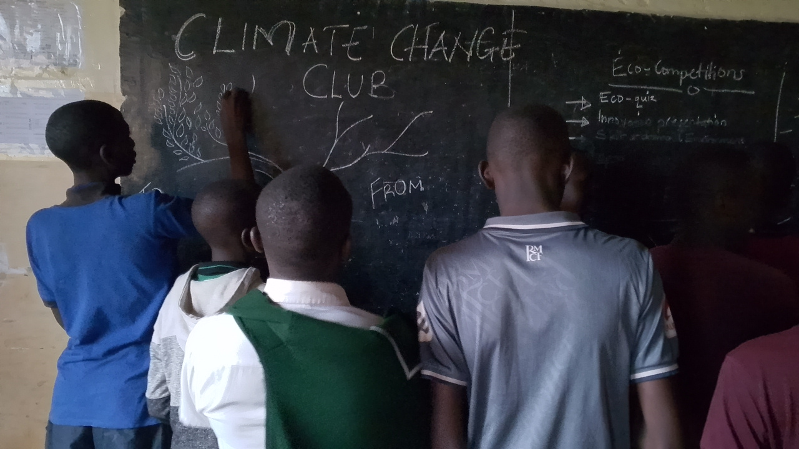
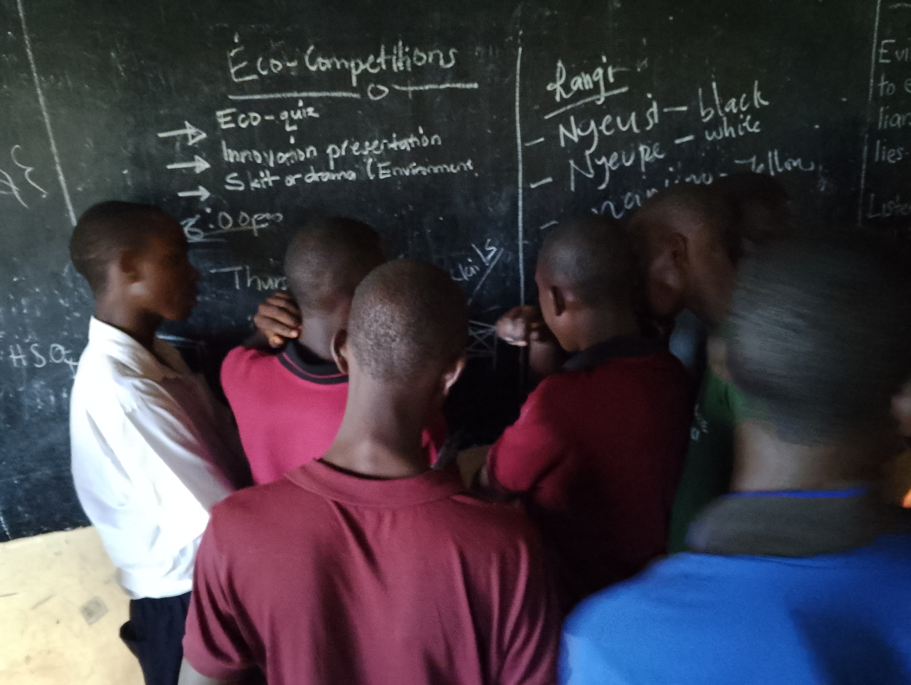
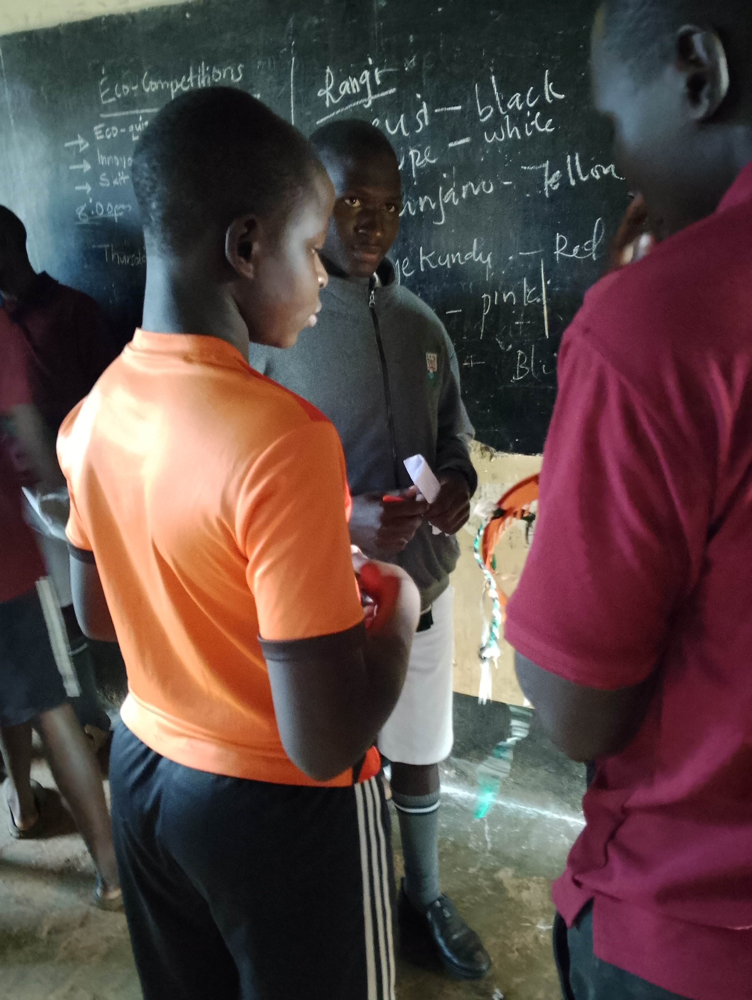
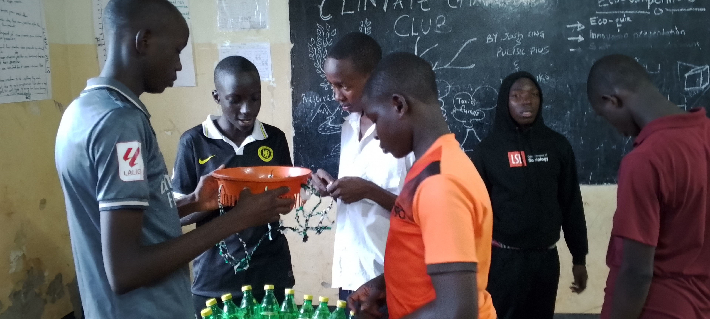
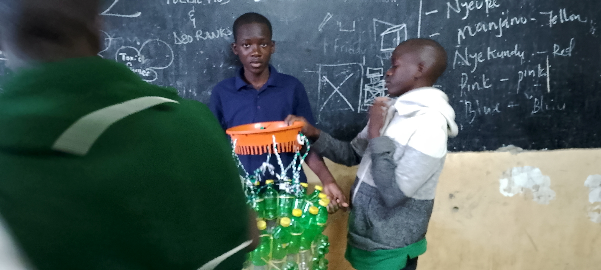

In our complex world, collaborative problem-solving can be challenging due to ineffective communication, unclear roles, and uneven participation among team members. When participants don’t fully understand their contributions or when some voices dominate the conversation, confusion and disengagement can arise. However, by setting clear goals and fostering open communication, we can transform this frustration into effective teamwork, enabling us to develop creative solutions to the challenges we face.

## Steps for Effective Collaborative Problem-Solving

### Establish Clear Goals
Establishing clear goals is crucial for successful collaboration. For example, a club aiming to reduce its carbon footprint might set a target to cut energy consumption by 20% by 2025, with an interim goal of a 10% reduction by the end of 2023. This fosters shared responsibility and teamwork.

### Choose the Right Problem
Identify specific climate challenges in your area by examining past events and engaging with local communities. By focusing on issues that matter most to those around you, you can develop practical solutions.

### Implement Solutions
Create a clear plan with defined steps and responsibilities for each member. Involve local organizations for support, raise awareness through campaigns, and start with a small pilot project to test your ideas.

### Measure Progress
Set clear benchmarks to track progress over time using specific metrics like energy savings or carbon reductions. Regularly collect data and feedback to evaluate success and identify areas for improvement.

### Launch Your Solution
When launching your climate solution, create a compelling narrative that highlights the problem and your innovative solution. Utilize social media, press releases, and community events to engage a broader audience.

By thoughtfully implementing these steps while incorporating strategies for clarity, engagement, and measurement, teams can enhance their collaborative efforts in addressing complex challenges like climate change effectively.

**About The Auther** :The auther is the patron of the Climate Change Club 